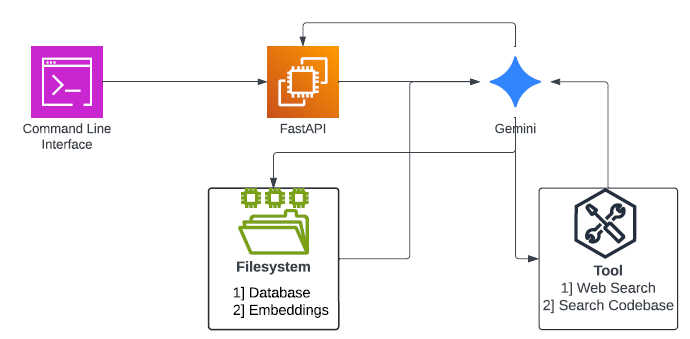
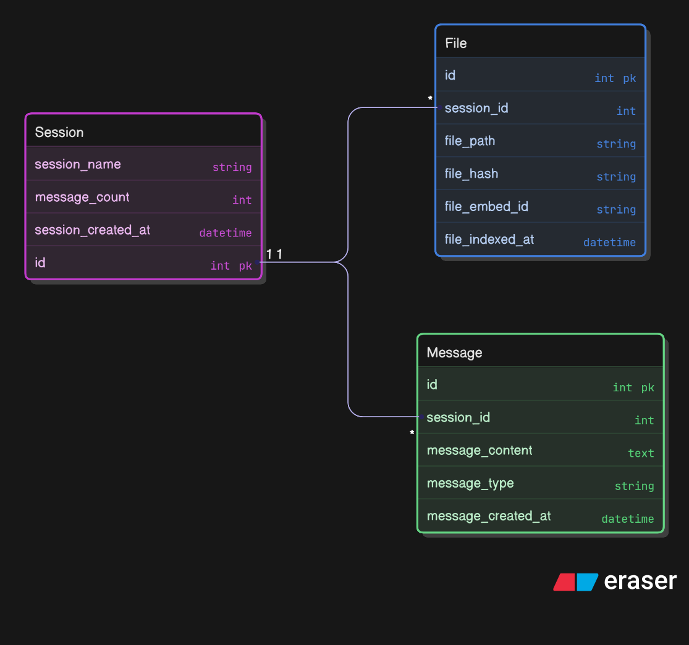
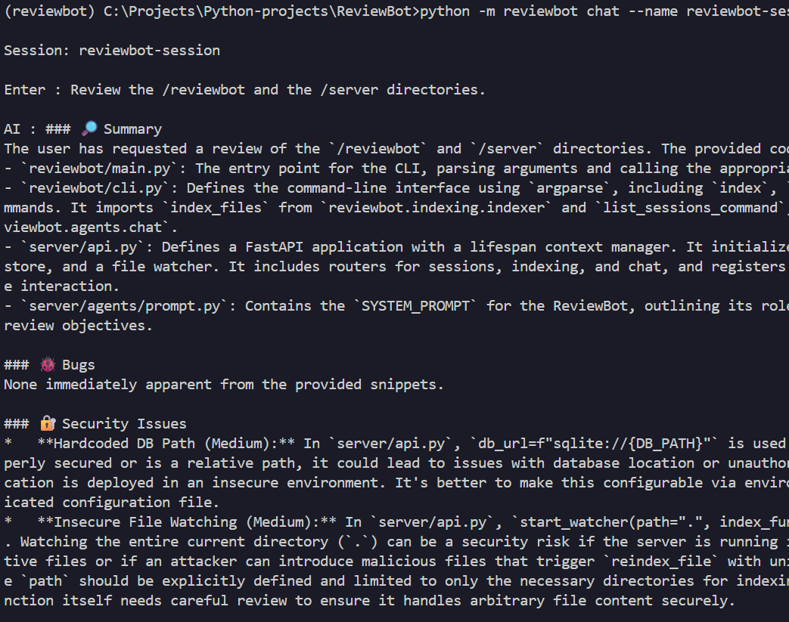
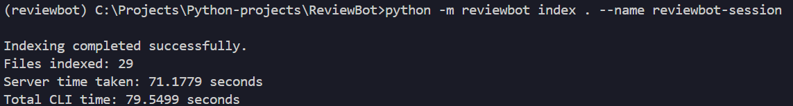
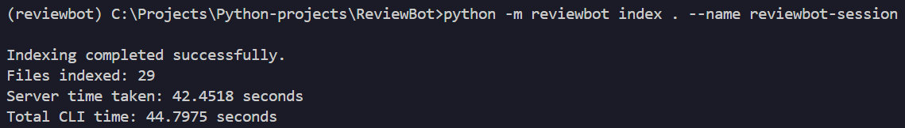

# ReviewBot

ReviewBot is an intelligent code review assistant designed to help developers maintain high code quality, identify potential issues, and streamline the review process. Leveraging advanced analysis capabilities, ReviewBot provides actionable feedback directly within your development workflow.

## Features

*   **Repository Indexing:** Indexes entire repositories by splitting files into chunks and generating embeddings for semantic search.
*   **RAG-based Code Understanding:** Uses retrieval-augmented generation (RAG) to answer questions about large codebases by retrieving relevant code chunks before generating responses.  
*   **Concurrent Processing:** Implements a concurrent indexing pipeline to process files in parallel, significantly improving repository indexing speed.
*   **Session-Based Chat:** Supports session-based conversations with memory, allowing users to maintain context across multiple queries during repository exploration.
*   **Semantic Code Search:** Uses ChromaDB vector storage to perform semantic search across indexed code chunks.

## Usage

ReviewBot is primarily used via its command-line interface.

### Basic Usage

To get started, you can run ReviewBot with a simple command:

```bash
reviewbot --help
```

This will display the available commands and options.

### Example: Indexing a File

```bash
reviewbot index <path/to/your/file.py> <path/to/your/file.py> --name <session-name>
```

### Example: Indexing a Directory

```bash
reviewbot index <path/to/your/dir/> <path/to/your/dir> --name <session-name> 
```

### Example: Reviewing 

```bash
reviewbot chat --name <session-name> # starts a interactive terminal chat.
```

## Development

### Setting up a Development Environment

1.  **Clone the repository:**
    ```bash
    git clone https://github.com/ammargit93/ReviewBot.git
    cd ReviewBot
    ```

2.  **Create and activate a virtual environment:**
    ```bash
    uv init
    ```

3.  **Install development dependencies:**
    ```bash
    uv sync
    ```

## Architecture



## Database Schema



## Output


## Performance Benchmarks

### Before Concurrency


### After Concurrency


<!-- ## Next steps
- avoid embedding recomputation on re-indexing of changed file(check with hashes).
- diff management(only embed file diffs).
- watchdog fastapi server.
- on every file-save run the indexer dont run on whitespace/empty strs/newlines.
- benchmark and optimise. (Optional)
- HTML web ui connected to fastapi server running locally. (Optional) -->
