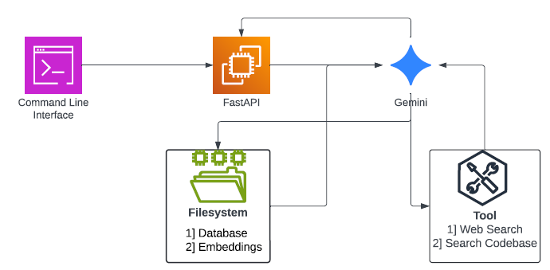
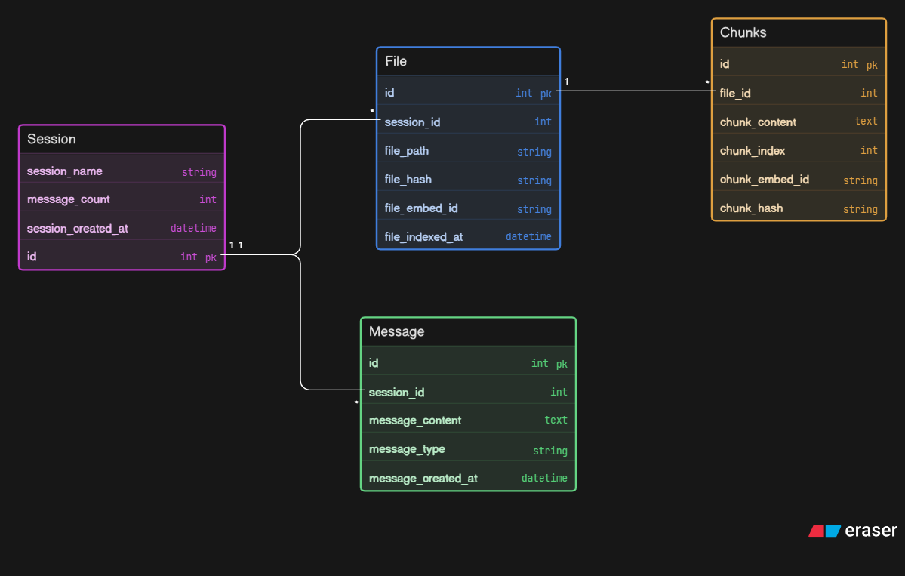
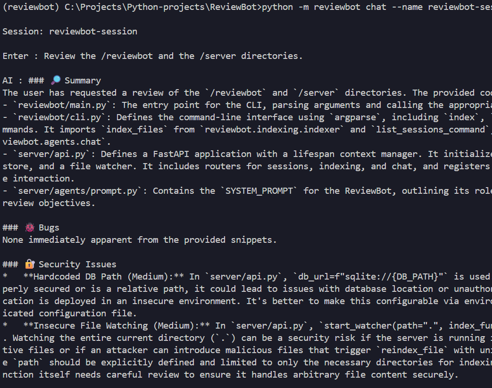
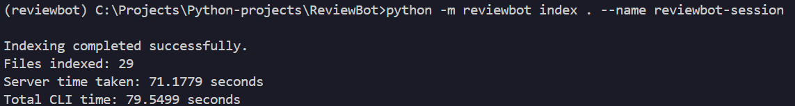
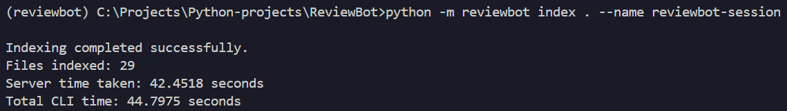

# ReviewBot

ReviewBot is an intelligent code review assistant designed to help developers maintain high code quality, identify potential issues, and streamline the review process. Leveraging advanced analysis capabilities, ReviewBot provides actionable feedback directly within your development workflow.

## Features

*   **Repository Indexing:** Indexes entire repositories by splitting files into chunks and generating embeddings for semantic search.
*   **Incremental Indexing:** Efficiently updates the index by only processing new or changed files, saving time and resources.
*   **RAG-based Code Understanding:** Uses retrieval-augmented generation (RAG) to answer questions about large codebases by retrieving relevant code chunks before generating responses.  
*   **Security Auditing:** Analyzes code for security vulnerabilities, bugs, and inefficient implementations with a priority on safety.
*   **Concurrent Processing:** Implements a concurrent indexing pipeline to process files in parallel, significantly improving repository indexing speed.
*   **Session-Based Chat:** Supports persistent, session-based conversations with memory, allowing users to maintain context across multiple queries.
*   **PDF Report Generation:** Generate structured PDF reports summarizing code reviews, security issues, and suggested improvements.
*   **FastAPI Backend:** Powered by a FastAPI server for robust session management and asynchronous processing.

## Usage

ReviewBot is used via its command-line interface. For chat functionality, the backend server must be running.

### Starting the Server

Before using the chat or session features, start the FastAPI server:

```bash
uvicorn server.api:app --reload
```

### Indexing a Repository

Use the `index` command to prepare your codebase for review.

```bash
# Index specific files or directories
reviewbot index <path/to/code> --name <session-name>

# Incremental indexing (skips unchanged files)
reviewbot index <path/to/code> --name <session-name> --incremental
```

### Managing Sessions

View and manage your review sessions:

```bash
# List all sessions
reviewbot sessions --list

# Delete a session
reviewbot sessions --delete <session-name>

# Resume a session
reviewbot sessions --resume <session-name>
```

### Chatting with ReviewBot

Start an interactive terminal chat once the repository is indexed and the server is running.

```bash
# Start chat for a session
reviewbot chat --name <session-name>
```

```bash
# Continue previous chat session    
reviewbot chat
```

## Development

### Setting up a Development Environment

1.  **Clone the repository:**
    ```bash
    git clone https://github.com/ammargit93/ReviewBot.git
    cd ReviewBot
    ```

2.  **Install dependencies:**
    ReviewBot uses `uv` for dependency management. Install dependencies and create a virtual environment:
    ```bash
    uv sync
    ```

3.  **Run ReviewBot:**
    You can run the CLI directly using `uv run`:
    ```bash
    uv run -m reviewbot --help
    ```

## Architecture



## Database Schema



## Output


## Performance Benchmarks

### Before Concurrency


### After Concurrency


<!-- ## Next steps
- [ ] Avoid embedding recomputation on re-indexing of changed file (check with hashes).
- [ ] Diff management (only embed file diffs).
- [ ] Watchdog FastAPI server integration for auto-indexing on file save.
- [ ] Benchmark and optimize performance.
- [ ] Implement a full HTML web UI connected to the FastAPI server. -->
